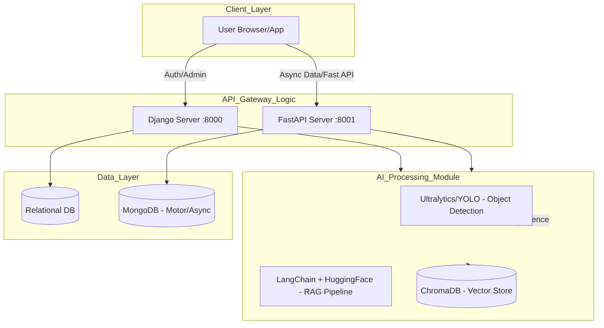

# MarineInsight

## Project Overview
MarineInsight is a sophisticated multi-service platform integrating **Computer Vision**, **Large Language Models (LLMs)**, and **Web Frameworks** to provide marine-related data processing and analysis. 

The project utilizes a dual-backend architecture:
1.  **Django Backend:** Handles core business logic, user authentication (JWT), and relational data management.
2.  **FastAPI Backend:** Manages high-performance asynchronous tasks, NoSQL data (MongoDB), and specialized API endpoints.
3.  **AI/ML Engine:** Leverages `ultralytics` (YOLO) for object detection, `tensorflow`/`torch` for deep learning, and `LangChain` for RAG (Retrieval-Augmented Generation) capabilities using `ChromaDB`.

## System Architecture & Flowchart

## Key Features
- **Object Detection:** Real-time marine species or vessel detection using `ultralytics`.
- **Intelligent Chat:** AI-driven insights using `LangChain` and `sentence-transformers`.
- **Hybrid Backend:** Combines the robustness of Django with the speed of FastAPI.
- **Vector Search:** Document indexing and retrieval using `ChromaDB` and `pypdf`.
- **Secure Auth:** JWT-based authentication across both backend services.

## Tech Stack

### Backends
- **Django 6.0:** Main application framework.
- **FastAPI:** High-performance async API service.
- **Uvicorn:** ASGI server implementation.

### Artificial Intelligence
- **Computer Vision:** `ultralytics` (YOLOv8+), `opencv-python`.
- **Deep Learning:** `tensorflow`, `torch`, `keras`.
- **NLP/LLM:** `langchain`, `transformers`, `huggingface-hub`.
- **Vector Database:** `chromadb`.

### Data & Utilities
- **Databases:** MongoDB (via `motor`), Relational DBs (via `SQLAlchemy`/Django ORM).
- **Processing:** `numpy`, `pandas` (polars), `scikit-learn`.

## Installation
1. Install dependencies for the main project:
   `pip install -r djangoproject/requirements.txt`
2. Install dependencies for the backend service:
   `pip install -r backend/requirements.txt`
3. Configure environment variables in `.env`.
4. Run servers using `python manage.py runserver` and `uvicorn main:app`.
